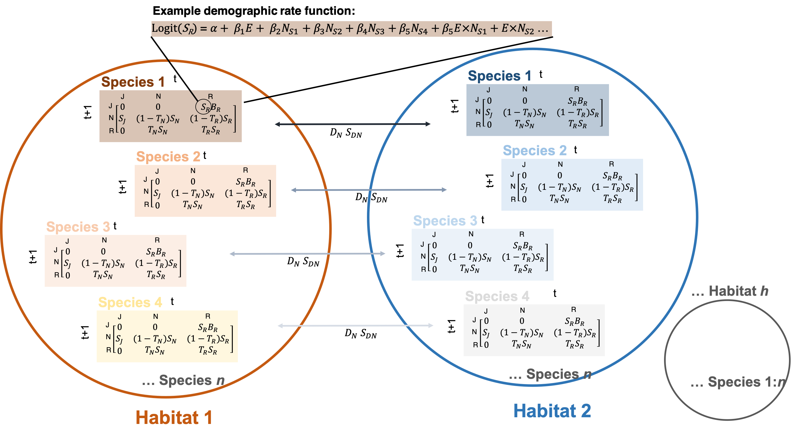

```{r setup,echo=FALSE,message=FALSE,warning=FALSE}
knitr::opts_chunk$set(message = FALSE, warning = FALSE)

# library(tidyverse,quietly = TRUE)
# library(Matrix) # needed for fill_demography_matrix
```

**Introduction**

The dynamics and composition of natural communities are ultimately determined by how individuals interact with their biotic and abiotic environment via demographic rates (survival and reproduction) in order to persist in space and time. Here, we develop hierarchical functions to scale from stage-specific demographic rates to community dynamics. The functions first describe stage-specific demographic rates for various species that are affected simultaneously by environmental factors and biotic interactions across different habitats. These rates then determine transitions among different life-cycle stages in a local populations and dispersal among populations, which, in turn, characterizes the metapopulation dynamics of all species in a community.  

The metapopulation framework implemented in these functions can model the dynamics of any number of species present in any number of sites, with the only constraint that we assume three distinct life stages, which generally correspond to juvenile individuals, non-reproductive adults, and reproductive adults. The methodology follows the vec-permutation approach introduced in Hunter & Caswell [(2005)](https://doi.org/10.1016/j.ecolmodel.2005.05.002) for projecting metapopulation abundances.

The vital rates considered in this framework include the survival probability of each life stage, the transitions between stages, reproductive outputs, and dispersal. Specifically:

* Sj: Survival probability of juveniles
* Sn: Survival probability of non-reproductive adults
* Sr: Survival probability of reproductive adults
* Rn: Probability of a non-reproductive adult to transition to the reproductive stage
* Rr: Probability of a reproductive adult to remain in the reproductive stage
* D:  Probability of dispersal (emigration)
* Ds: Probability of surviving all stages of dispersal and establishing in a new site (immigration) 
* O:  Recrutiment, i.e., per capita number of offspring that survive to the juvenile stage produced (≥ 0)  

These vital rates can be parameterized to differ weakly or strongly between sites and species. They arise from the combined effect of species-specific values (given by the density of the focal species, $N_{s1}$ below), the effect of individuals of other species present in the same site ($N_{s2,...,sn}$), and potentially the effect of environmental variables ($E$). In particular, for a given vital rate $v$ of a species $s1$, they are computed as: 

$$Logit(v_{s1}) = \alpha + \beta_1*N_{s1} + \sum_{i \in {s2,...,sn}} \beta_i*Ni + \beta_E*E$$

In this formulation, interactions between species densities and the environment are not shown for readability, but these can be included as well.

```{r echo=FALSE, out.width = "99%", fig.cap="Conceptual overview of metapopulation functions. We model stage-specific demographic transitions from t to t+1 (here, t = one year) using a matrix population model for populations of n species in h sites. Stages are juveniles, J, non-reproductive, N, and reproductive, R. Stage transitions depend on demographic rates of survival (S), transition probability to the reproductive stage (T), and recruitment (O). Non-reproductive individuals can also disperse (DN) and have a probabaility of SDN to survive dispersal. The example logistic regression for species 1 shows that rates are modeled as functions of an environmental variable (E) and intra- (here NS1) and interspecific (here NS2, NS3, NS4) density.The different colors highlight that the mean demographic rates (the α in the models) differ among species and habitats."}
# All defaults

```

**Data structures**

The vec-permutation approach relies on a block-diagonal formulation of the demographic and dispersal processes. For each species, demographic changes are described by B, a block-diagonal matrix where the i{th} diagonal block $K_i$ is a 3x3 matrix population model at site $i$. Dispersal is described by $M$, another block-diagonal matrix where the j{th} diagonal block $L_j$ is a $i*i$ matrix of disperal probabilities for each stage $j$. In our case, non-reproductive adults disperse to become reproductive adults in a different site, and we therefore populate the corresponding off-diagonal element of $M$. Our metapopulation model assumes that local demography happens first and then individuals disperse.      

To run our approach of metatpopulation dynamics of interacting pecies, we need to define a series of data structures. The first one is the nested list that holds the coefficients for obtaining vital rates for every species in every site. This `param` data structure thus holds the $\alpha$ and $\beta$ coefficients from Eq. 1. It is created with the function `build_param`, and populated with the function `generate_vital_rate_coefs`.

The function `build_param` accepts the name of the species modelled, the number or name of sites, a string giving the vital rates included, and an argument `env` specifying whether environmental forcing is to be accounted for. Lastly, the coefficients from Eq. 1 may include the interaction between the density of one or more species and the environment. The user has the possibility to limit the number of env:species interactions by setting the argument `num.params`. For example, given three species and including environmental forcing, there are a minimum of 3+1+1 coefficients (the intercept, one coefficient for the effect of each species, and one coefficient for the environmental effect), and a maximum of 3+1+1+3 coefficients, by including each interaction. In this example, we include only one interaction, for a total of six coefficients. It is assumed that the interactions included follow the order in which the species are entered. In this case, the interaction included is assumed to be the one with the first species, i.e. `s1:env`.

```{r}

# load the package
library(cxr)

# define species names
sp <- c("s1","s2","s3")
# number of species
num.sp <- length(sp)

# define site names
sites <- c("sa","sb")
# number of sites
num.sites <- length(sites)

# number of demographic stages - this should be always fixed
num.stages <- 3

# vital rates to account for - these names should be fixed
rates <- c("Sj","Sn","Sr","Rn","Rr","D","Ds","O")

# environmental forcing?
env <- TRUE

# this builds the data structure - still empty
param <- build_param(sp = sp,
                     sites = sites,
                     rates = rates,
                     env = env, 
                     num.params = 6)
```

The `param` structure is a nested list, sorted by species in the first level and site in the second level. Each element is a matrix of dimensions number of vital rates by number of coefficients.

```{r}
param[["s1"]][["sa"]]
```

There are a number of ways in which these matrices can be populated. The elements, as shown by Eq. 1, are equivalent to the coefficients of a Generalized Linear Model. Therefore, if the user has a tidy table with the same number of coefficients, this table can be input to the `generate_vital_rate_coefs` function via the `glm.object` argument. Otherwise, coefficients can be entered manually, or from average and standard deviations from a normal distribution. Here we enter the coefficient for the intercept (`vr.coef = "alpha"`) of the survival of juveniles (`vital.rate = c("Sj")`), for the first species (`sp = "s1"`) and all sites (by not specifying the `sites` argument), setting the mean and sd values from which random samples will be drawn.

```{r}
param <- generate_vital_rate_coefs(param = param,
                                   sp = "s1",
                                   # sites = "sa",
                                   vital.rate = c("Sj"),#,"Sn","Sr","Rn","Rr","O"),
                                   vr.coef = "alpha",
                                   mean.coef = .1,sd.coef = 0)
```

```{r echo=FALSE}

param <- generate_vital_rate_coefs(param = param,
                                   sp = "s1",
                                   # sites = "sa",
                                   vital.rate = c("Sn"),
                                   vr.coef = "alpha",
                                   mean.coef = 1.8,sd.coef = 0)

param <- generate_vital_rate_coefs(param = param,
                                   sp = "s1",
                                   # sites = "sa",
                                   vital.rate = c("Sr"),#,"Sn","Sr","Rn","Rr","O"),
                                   vr.coef = "alpha",
                                   mean.coef = 3,sd.coef = 0)
param <- generate_vital_rate_coefs(param = param,
                                   sp = "s1",
                                   # sites = "sa",
                                   vital.rate = c("Rn"),#,"Sn","Sr","Rn","Rr","O"),
                                   vr.coef = "alpha",
                                   mean.coef = 3,sd.coef = 0)
param <- generate_vital_rate_coefs(param = param,
                                   sp = "s1",
                                   # sites = "sa",
                                   vital.rate = c("Rr"),#,"Sn","Sr","Rn","Rr","O"),
                                   vr.coef = "alpha",
                                   mean.coef = 1.5,sd.coef = 0)
param <- generate_vital_rate_coefs(param = param,
                                   sp = "s1",
                                   # sites = "sa",
                                   vital.rate = c("D"),#,"Sn","Sr","Rn","Rr","O"),
                                   vr.coef = "alpha",
                                   mean.coef = -0.08,sd.coef = 0)
param <- generate_vital_rate_coefs(param = param,
                                   sp = "s1",
                                   # sites = "sa",
                                   vital.rate = c("Ds"),#,"Sn","Sr","Rn","Rr","O"),
                                   vr.coef = "alpha",
                                   mean.coef = 2.1,sd.coef = 0)
param <- generate_vital_rate_coefs(param = param,
                                   sp = "s1",
                                   # sites = "sa",
                                   vital.rate = c("O"),#,"Sn","Sr","Rn","Rr","O"),
                                   vr.coef = "alpha",
                                   mean.coef = 3,sd.coef = 0)

# -------------------------------------------------------------------------
# alphas for sp2
param <- generate_vital_rate_coefs(param = param,
                                   sp = "s2",
                                   # sites = "sa",
                                   vital.rate = c("Sj"),#,"Sn","Sr","Rn","Rr","O"),
                                   vr.coef = "alpha",
                                   mean.coef = 1.5,sd.coef = 0)
param <- generate_vital_rate_coefs(param = param,
                                   sp = "s2",
                                   # sites = "sa",
                                   vital.rate = c("Sn"),
                                   vr.coef = "alpha",
                                   mean.coef = 3.1,sd.coef = 0)
param <- generate_vital_rate_coefs(param = param,
                                   sp = "s2",
                                   # sites = "sa",
                                   vital.rate = c("Sr"),#,"Sn","Sr","Rn","Rr","O"),
                                   vr.coef = "alpha",
                                   mean.coef = 3.5,sd.coef = 0)
param <- generate_vital_rate_coefs(param = param,
                                   sp = "s2",
                                   # sites = "sa",
                                   vital.rate = c("Rn"),#,"Sn","Sr","Rn","Rr","O"),
                                   vr.coef = "alpha",
                                   mean.coef = 0.8,sd.coef = 0)
param <- generate_vital_rate_coefs(param = param,
                                   sp = "s2",
                                   # sites = "sa",
                                   vital.rate = c("Rr"),#,"Sn","Sr","Rn","Rr","O"),
                                   vr.coef = "alpha",
                                   mean.coef = 2,sd.coef = 0)
param <- generate_vital_rate_coefs(param = param,
                                   sp = "s2",
                                   # sites = "sa",
                                   vital.rate = c("D"),#,"Sn","Sr","Rn","Rr","O"),
                                   vr.coef = "alpha",
                                   mean.coef = 0.01,sd.coef = 0)
param <- generate_vital_rate_coefs(param = param,
                                   sp = "s2",
                                   # sites = "sa",
                                   vital.rate = c("Ds"),#,"Sn","Sr","Rn","Rr","O"),
                                   vr.coef = "alpha",
                                   mean.coef = 3,sd.coef = 0)
param <- generate_vital_rate_coefs(param = param,
                                   sp = "s2",
                                   # sites = "sa",
                                   vital.rate = c("O"),#,"Sn","Sr","Rn","Rr","O"),
                                   vr.coef = "alpha",
                                   mean.coef = 2,sd.coef = 0)

# -------------------------------------------------------------------------
# alphas for sp3
param <- generate_vital_rate_coefs(param = param,
                                   sp = "s3",
                                   # sites = "sa",
                                   vital.rate = c("Sj"),#,"Sn","Sr","Rn","Rr","O"),
                                   vr.coef = "alpha",
                                   mean.coef = 0.01,sd.coef = 0)
param <- generate_vital_rate_coefs(param = param,
                                   sp = "s3",
                                   # sites = "sa",
                                   vital.rate = c("Sn"),
                                   vr.coef = "alpha",
                                   mean.coef = 3,sd.coef = 0)
param <- generate_vital_rate_coefs(param = param,
                                   sp = "s3",
                                   # sites = "sa",
                                   vital.rate = c("Sr"),#,"Sn","Sr","Rn","Rr","O"),
                                   vr.coef = "alpha",
                                   mean.coef = 3.8,sd.coef = 0)
param <- generate_vital_rate_coefs(param = param,
                                   sp = "s3",
                                   # sites = "sa",
                                   vital.rate = c("Rn"),#,"Sn","Sr","Rn","Rr","O"),
                                   vr.coef = "alpha",
                                   mean.coef = 0.8,sd.coef = 0)
param <- generate_vital_rate_coefs(param = param,
                                   sp = "s3",
                                   # sites = "sa",
                                   vital.rate = c("Rr"),#,"Sn","Sr","Rn","Rr","O"),
                                   vr.coef = "alpha",
                                   mean.coef = 1.8,sd.coef = 0)

param <- generate_vital_rate_coefs(param = param,
                                   sp = "s3",
                                   sites = "sa",
                                   vital.rate = c("D"),#,"Sn","Sr","Rn","Rr","O"),
                                   vr.coef = "alpha",
                                   mean.coef = 0.05,sd.coef = 0)
param <- generate_vital_rate_coefs(param = param,
                                   sp = "s3",
                                   sites = "sb",
                                   vital.rate = c("D"),#,"Sn","Sr","Rn","Rr","O"),
                                   vr.coef = "alpha",
                                   mean.coef = 0.08,sd.coef = 0)

param <- generate_vital_rate_coefs(param = param,
                                   sp = "s3",
                                   sites = "sa",
                                   vital.rate = c("Ds"),#,"Sn","Sr","Rn","Rr","O"),
                                   vr.coef = "alpha",
                                   mean.coef = 2.15,sd.coef = 0)
param <- generate_vital_rate_coefs(param = param,
                                   sp = "s3",
                                   sites = "sb",
                                   vital.rate = c("Ds"),#,"Sn","Sr","Rn","Rr","O"),
                                   vr.coef = "alpha",
                                   mean.coef = 2.10,sd.coef = 0)

param <- generate_vital_rate_coefs(param = param,
                                   sp = "s3",
                                   # sites = "sa",
                                   vital.rate = c("O"),#,"Sn","Sr","Rn","Rr","O"),
                                   vr.coef = "alpha",
                                   mean.coef = .1,sd.coef = 0)


# -------------------------------------------------------------------------
# beta1 sp1
param <- generate_vital_rate_coefs(param = param,
                                   sp = "s1",
                                   # vital.rate = c("Sj","Sn","Sr","Rn","Rr","D","O"),
                                   vr.coef = c("beta1"),
                                   mean.coef = 0.08,sd.coef = 0)
# dispersal site 2
param <- generate_vital_rate_coefs(param = param,
                                   sp = "s1",
                                   vital.rate = c("D"),
                                   sites = "sb",
                                   vr.coef = c("beta1"),
                                   mean.coef = -0.08,sd.coef = 0)
# beta1 dispersal surv site 2
param <- generate_vital_rate_coefs(param = param,
                                   sp = "s1",
                                   vital.rate = c("Ds"),
                                   sites = "sb",
                                   vr.coef = c("beta1"),
                                   mean.coef = 0.01,sd.coef = 0)
# O site 2
param <- generate_vital_rate_coefs(param = param,
                                   sp = "s1",
                                   sites = "sb",
                                   vital.rate = c("O"),
                                   vr.coef = c("beta1"),
                                   mean.coef = 0.1,sd.coef = 0)

# -------------------------------------------------------------------------
# beta1 sp2
param <- generate_vital_rate_coefs(param = param,
                                   sp = "s2",
                                   # vital.rate = c("Sj","Sn","Sr","Rn","Rr","D","O"),
                                   vr.coef = c("beta1"),
                                   mean.coef = 0.07,sd.coef = 0)
param <- generate_vital_rate_coefs(param = param,
                                   sp = "s2",
                                   vital.rate = c("D"),
                                   sites = "sb",
                                   vr.coef = c("beta1"),
                                   mean.coef = -0.07,sd.coef = 0)
param <- generate_vital_rate_coefs(param = param,
                                   sp = "s2",
                                   vital.rate = c("Ds"),
                                   sites = "sb",
                                   vr.coef = c("beta1"),
                                   mean.coef = 0.05,sd.coef = 0)

# -------------------------------------------------------------------------
# beta1 sp3
param <- generate_vital_rate_coefs(param = param,
                                   sp = "s3",
                                   # vital.rate = c("Sj","Sn","Sr","Rn","Rr","D","O"),
                                   vr.coef = c("beta1"),
                                   mean.coef = 0.05,sd.coef = 0)
param <- generate_vital_rate_coefs(param = param,
                                   sp = "s3",
                                   vital.rate = c("D"),
                                   sites = "sb",
                                   vr.coef = c("beta1"),
                                   mean.coef = -0.05,sd.coef = 0)
param <- generate_vital_rate_coefs(param = param,
                                   sp = "s3",
                                   vital.rate = c("Ds"),
                                   sites = "sb",
                                   vr.coef = c("beta1"),
                                   mean.coef = 0.01,sd.coef = 0)

# -------------------------------------------------------------------------
# beta2 sp1
param <- generate_vital_rate_coefs(param = param,
                                   sp = "s1",
                                   vital.rate = c("Sj","Sn","Sr","Rn","Rr"),
                                   vr.coef = c("beta2"),
                                   mean.coef = -0.07,sd.coef = 0)
# D
param <- generate_vital_rate_coefs(param = param,
                                   sp = "s1",
                                   vital.rate = c("D"),
                                   vr.coef = c("beta2"),
                                   mean.coef = 0.12,sd.coef = 0)
# Ds
param <- generate_vital_rate_coefs(param = param,
                                   sp = "s1",
                                   vital.rate = c("Ds"),
                                   vr.coef = c("beta2"),
                                   mean.coef = 0,sd.coef = 0)
# O 
param <- generate_vital_rate_coefs(param = param,
                                   sp = "s1",
                                   vital.rate = c("O"),
                                   vr.coef = c("beta2"),
                                   mean.coef = -0.1,sd.coef = 0)
# -------------------------------------------------------------------------
# beta2 sp2
param <- generate_vital_rate_coefs(param = param,
                                   sp = "s2",
                                   vital.rate = c("Sj","Sn","Sr","Rn","Rr"),
                                   vr.coef = c("beta2"),
                                   mean.coef = -0.2,sd.coef = 0)
# D
param <- generate_vital_rate_coefs(param = param,
                                   sp = "s2",
                                   vital.rate = c("D"),
                                   vr.coef = c("beta2"),
                                   mean.coef = 0.1,sd.coef = 0)
# Ds
param <- generate_vital_rate_coefs(param = param,
                                   sp = "s2",
                                   vital.rate = c("Ds"),
                                   vr.coef = c("beta2"),
                                   mean.coef = 0,sd.coef = 0)
# O 
param <- generate_vital_rate_coefs(param = param,
                                   sp = "s2",
                                   sites = "sa",
                                   vital.rate = c("O"),
                                   vr.coef = c("beta2"),
                                   mean.coef = -0.3,sd.coef = 0)
param <- generate_vital_rate_coefs(param = param,
                                   sp = "s2",
                                   sites = "sb",
                                   vital.rate = c("O"),
                                   vr.coef = c("beta2"),
                                   mean.coef = -0.2,sd.coef = 0)
# -------------------------------------------------------------------------
# beta2 sp3
param <- generate_vital_rate_coefs(param = param,
                                   sp = "s3",
                                   vital.rate = c("Sj","Sn","Sr","Rn","Rr"),
                                   vr.coef = c("beta2"),
                                   mean.coef = -0.2,sd.coef = 0)
# D
param <- generate_vital_rate_coefs(param = param,
                                   sp = "s3",
                                   vital.rate = c("D"),
                                   vr.coef = c("beta2"),
                                   mean.coef = 0.2,sd.coef = 0)
# Ds
param <- generate_vital_rate_coefs(param = param,
                                   sp = "s3",
                                   vital.rate = c("Ds"),
                                   vr.coef = c("beta2"),
                                   mean.coef = 0,sd.coef = 0)
# O 
param <- generate_vital_rate_coefs(param = param,
                                   sp = "s3",
                                   vital.rate = c("O"),
                                   vr.coef = c("beta2"),
                                   mean.coef = -0.18,sd.coef = 0)
# -------------------------------------------------------------------------
# beta3 sp1
param <- generate_vital_rate_coefs(param = param,
                                   sp = "s1",
                                   vital.rate = c("Sj","Sn","Sr","Rr","D","O"),
                                   vr.coef = c("beta3"),
                                   mean.coef = -0.1,sd.coef = 0)
# Rn
param <- generate_vital_rate_coefs(param = param,
                                   sp = "s1",
                                   sites = "sa",
                                   vital.rate = c("Rn"),
                                   vr.coef = c("beta3"),
                                   mean.coef = .05,sd.coef = 0)
param <- generate_vital_rate_coefs(param = param,
                                   sp = "s1",
                                   sites = "sb",
                                   vital.rate = c("Rn"),
                                   vr.coef = c("beta3"),
                                   mean.coef = .02,sd.coef = 0)
# Ds
param <- generate_vital_rate_coefs(param = param,
                                   sp = "s1",
                                   vital.rate = c("Ds"),
                                   vr.coef = c("beta3"),
                                   mean.coef = 0,sd.coef = 0)
# -------------------------------------------------------------------------
# beta3 sp2
param <- generate_vital_rate_coefs(param = param,
                                   sp = "s2",
                                   sites = "sa",
                                   vital.rate = c("Sj","Sn","Sr","Rr","D","O"),
                                   vr.coef = c("beta3"),
                                   mean.coef = 0.04,sd.coef = 0)
param <- generate_vital_rate_coefs(param = param,
                                   sp = "s2",
                                   sites = "sb",
                                   vital.rate = c("Sj","Sn","Sr","Rr","D","O"),
                                   vr.coef = c("beta3"),
                                   mean.coef = 0.02,sd.coef = 0)
# Rn
param <- generate_vital_rate_coefs(param = param,
                                   sp = "s2",
                                   sites = "sa",
                                   vital.rate = c("Rn"),
                                   vr.coef = c("beta3"),
                                   mean.coef = -.05,sd.coef = 0)
param <- generate_vital_rate_coefs(param = param,
                                   sp = "s2",
                                   sites = "sb",
                                   vital.rate = c("Rn"),
                                   vr.coef = c("beta3"),
                                   mean.coef = -.02,sd.coef = 0)
# Ds
param <- generate_vital_rate_coefs(param = param,
                                   sp = "s2",
                                   vital.rate = c("Ds"),
                                   vr.coef = c("beta3"),
                                   mean.coef = 0,sd.coef = 0)
# -------------------------------------------------------------------------
# beta3 sp3
param <- generate_vital_rate_coefs(param = param,
                                   sp = "s3",
                                   vital.rate = c("Sj","Sn","Sr","Rr","D","O"),
                                   vr.coef = c("beta3"),
                                   mean.coef = 0.08,sd.coef = 0)
# Rn
param <- generate_vital_rate_coefs(param = param,
                                   sp = "s3",
                                   vital.rate = c("Rn"),
                                   vr.coef = c("beta3"),
                                   mean.coef = -0.11,sd.coef = 0)
# Ds
param <- generate_vital_rate_coefs(param = param,
                                   sp = "s3",
                                   vital.rate = c("Ds"),
                                   vr.coef = c("beta3"),
                                   mean.coef = 0,sd.coef = 0)
# -------------------------------------------------------------------------
# beta4 sp1
param <- generate_vital_rate_coefs(param = param,
                                   sp = "s1",
                                   sites = "sa",
                                   vital.rate = c("Sj","Sn","Sr","Rr","D","O"),
                                   vr.coef = c("beta4"),
                                   mean.coef = -0.02,sd.coef = 0)
param <- generate_vital_rate_coefs(param = param,
                                   sp = "s1",
                                   sites = "sb",
                                   vital.rate = c("Sj","Sn","Sr","Rr","D","O"),
                                   vr.coef = c("beta4"),
                                   mean.coef = -0.03,sd.coef = 0)
# Rn
param <- generate_vital_rate_coefs(param = param,
                                   sp = "s1",
                                   sites = "sa",
                                   vital.rate = c("Rn"),
                                   vr.coef = c("beta4"),
                                   mean.coef = 0.02,sd.coef = 0)
param <- generate_vital_rate_coefs(param = param,
                                   sp = "s1",
                                   sites = "sb",
                                   vital.rate = c("Rn"),
                                   vr.coef = c("beta4"),
                                   mean.coef = .05,sd.coef = 0)
# Ds
param <- generate_vital_rate_coefs(param = param,
                                   sp = "s1",
                                   vital.rate = c("Ds"),
                                   vr.coef = c("beta4"),
                                   mean.coef = 0,sd.coef = 0)
# -------------------------------------------------------------------------
# beta4 sp2
param <- generate_vital_rate_coefs(param = param,
                                   sp = "s2",
                                   vital.rate = c("Sn","Sr","Rr","D","O"),
                                   vr.coef = c("beta4"),
                                   mean.coef = -0.01,sd.coef = 0)
# Sj
param <- generate_vital_rate_coefs(param = param,
                                   sp = "s2",
                                   vital.rate = c("Sj"),
                                   vr.coef = c("beta4"),
                                   mean.coef = -0.001,sd.coef = 0)
# Rn
param <- generate_vital_rate_coefs(param = param,
                                   sp = "s2",
                                   sites ="sa",
                                   vital.rate = c("Rn"),
                                   vr.coef = c("beta4"),
                                   mean.coef = 0.01,sd.coef = 0)
param <- generate_vital_rate_coefs(param = param,
                                   sp = "s2",
                                   sites ="sb",
                                   vital.rate = c("Rn"),
                                   vr.coef = c("beta4"),
                                   mean.coef = 0.05,sd.coef = 0)
# Ds
param <- generate_vital_rate_coefs(param = param,
                                   sp = "s2",
                                   vital.rate = c("Ds"),
                                   vr.coef = c("beta4"),
                                   mean.coef = 0,sd.coef = 0)
# -------------------------------------------------------------------------
# beta4 sp3
param <- generate_vital_rate_coefs(param = param,
                                   sp = "s3",
                                   vital.rate = c("Sj","Sn","Sr","Rr","D","O"),
                                   vr.coef = c("beta4"),
                                   mean.coef = -0.01,sd.coef = 0)
# Rn
param <- generate_vital_rate_coefs(param = param,
                                   sp = "s3",
                                   vital.rate = c("Rn"),
                                   vr.coef = c("beta4"),
                                   mean.coef = 0.01,sd.coef = 0)
# Ds
param <- generate_vital_rate_coefs(param = param,
                                   sp = "s3",
                                   vital.rate = c("Ds"),
                                   vr.coef = c("beta4"),
                                   mean.coef = 0,sd.coef = 0)
# -------------------------------------------------------------------------
# beta5 sp1,sp2,sp3
param <- generate_vital_rate_coefs(param = param,
                                   # sp = "s1",
                                   # vital.rate = c("Sj","Sn","Sr","Rr","D","O"),
                                   vr.coef = c("beta5"),
                                   mean.coef = 0.01,sd.coef = 0)
```

The rest of the coefficients are filled up likewise, for a final set of matrices similar to this:

```{r}
param[["s1"]][["sa"]]
```

Currently, our framework accepts a single environmental factor that varies throughout the number of projected timesteps

```{r}
years <- 100 # years (or time steps) of simulations

# simulate environment from normal distribution
set.seed(123)
env <- rnorm(years, mean=0, sd=1)
```

Next, we define the structure that will hold the vec-permutation matrices, with the given number of species, sites, and stages. There are three types of matrices in the vec-permutation methodology: permutation matrices, dispersal, and demography. There is one matrix of each type for each species, and these matrices all have dimensions of number of stages multiplied by number of sites in both rows and columns.

```{r}
# build the templates for the vec-permutation matrices
# returns a nested list: [[matrix.type]][[species number]]
# where matrix.type is "demography", "dispersal", or "permutation"
vpm <- vec_permutation_matrices(num.sp,num.sites,num.stages)
# for example
vpm[["demography"]][[1]]
```

We also need to define manually the initial abundances of each species at each stage in each site. These are stored in a list in which each element holds the abundance of a given species in a matrix of dimensions number of sites in rows and life stages in columns.

```{r}
# initial.densities: list: [[species]][sites*stages]
# this needs to be filled manually
initial.densities <- list()
# sp1
initial.densities[[1]] <- matrix(c(20,20,15,20,20,13),
                                 nrow = num.sites,
                                 ncol = num.stages,
                                 byrow = TRUE)
# sp2
initial.densities[[2]] <- matrix(c(25,15,3,25,15,3),
                                 nrow = num.sites,
                                 ncol = num.stages,
                                 byrow = TRUE)
# sp2
initial.densities[[3]] <- matrix(c(5,5,2,3,4,2),
                                 nrow = num.sites,
                                 ncol = num.stages,
                                 byrow = TRUE)
```

For example, the initial abundances of the first species are as follows:

```{r}
initial.densities[[1]]
```

Where there are `r initial.densities[[1]][1,1]` juvenile individuals at site 1, `r initial.densities[[1]][1,3]` reproductive adults at site 1, and so on.

Lastly, we need to define the data structure that will store the whole projected dynamics, i.e. species densities in each timestep, site, and stage. This is, again, a nested list with species in the first level, year (or more generally, timestep) in the second level, and each element of the third level being a matrix of dimensions of number of sites (rows) by number of stages (columns). 

```{r}
# projected.densities list: [[species]][[years]][[sites*stages]
projected.densities <- list()
for(i.sp in 1:num.sp){
  projected.densities[[i.sp]] <- list()
  for(i.year in 1:years){
    projected.densities[[i.sp]][[i.year]] <- matrix(0,
                                                    nrow = num.sites,
                                                    ncol = num.stages)
  }
}
```

**Projecting population densities**

The densities of each species at each timestep are calculated within a loop. In this loop, first we update the transition matrix of each species, given their prior densities and coefficients. This is done with the function `fill_transition_matrix`. Second, we update the vec-permutation demography and dispersal matrices of each species, with the functions `fill_demography_matrix` and `fill_dispersal_matrix`. With these two matrices, we can finally obtain the expected density of each species at the next timestep using the function `calculate_densities`.

```{r}
# create an auxiliary list, to keep track of the densities per timestep
current.densities <- initial.densities

for(i.year in 1:years){
  
  # Update projected densities at this timestep
  for(i.sp in 1:num.sp){
    projected.densities[[i.sp]][[i.year]] <- current.densities[[i.sp]]
  }
  
  # update transition matrices ----------------------------------------------
  
  # this is a list per species and site
  transition_matrices <- list()
  
  for(i.sp in 1:length(sp)){
    transition_matrices[[i.sp]] <- list()
    for(i.site in 1:length(sites)){
      
      # store the transition matrix for this sp and site
      transition_matrices[[i.sp]][[i.site]] <- fill_transition_matrix(focal.sp = i.sp,
                                                                      site = i.site,
                                                                      param = param,
                                                                      env = env[i.year],
                                                                      current.densities = current.densities)
      
    }# for each site
    names(transition_matrices[[i.sp]]) <- sites
  }# for each species
  names(transition_matrices) <- sp
  
  # update demography and dispersal matrices --------------------------------
  
  for(i.sp in 1:length(sp)){
    
    # demography
    vpm[["demography"]][[i.sp]] <- fill_demography_matrix(focal.sp = i.sp,
                                                          vpm = vpm,
                                                          transition_matrices = transition_matrices)
    # dispersal
    vpm[["dispersal"]][[i.sp]] <- fill_dispersal_matrix(focal.sp = i.sp,
                                                        num.sites = num.sites,
                                                        param = param,
                                                        vpm = vpm,
                                                        env = env[i.year],
                                                        current.densities = current.densities) 
  }# for i.sp
  
  # update densities --------------------------------------------------------
  # all stages and sites for each species
  for(i.sp in 1:length(sp)){
    current.densities[[i.sp]] <- calculate_densities(focal.sp = i.sp,
                                                     vpm,
                                                     current.densities)
  }# for i.sp
}# for i.year
```

Finally, we can plot the resulting dynamics over time, species, and/or sites

```{r}
# transform list of projected densities to dataframe
df <- densities_to_df(projected.densities)

# tidy
df$species <- dplyr::recode(as.character(df$species), "1" = "S1", "2" = "S2", "3" = "S3")

# plot
dynamics.plot <- ggplot2::ggplot(df,ggplot2::aes(year,density,col=species))+
  ggplot2::geom_line()+
  ggplot2::facet_grid(stage~site,scales = "free")+
  ggplot2::scale_color_manual(name="",values=c("darkgreen","orange","darkred"))+
  ggplot2::xlab("Simulation year")+ggplot2::ylab("Total density")+
  ggplot2::theme_bw(base_size=20)+
  ggplot2::theme(panel.grid = ggplot2::element_blank())+
  ggplot2::theme(panel.grid.major = ggplot2::element_blank(),
        panel.grid.minor = ggplot2::element_blank(),
        strip.background = ggplot2::element_blank(),
        panel.border = ggplot2::element_rect(colour = "black"))
```

```{r echo=FALSE, fig.height=9, fig.width=7}
dynamics.plot
```


